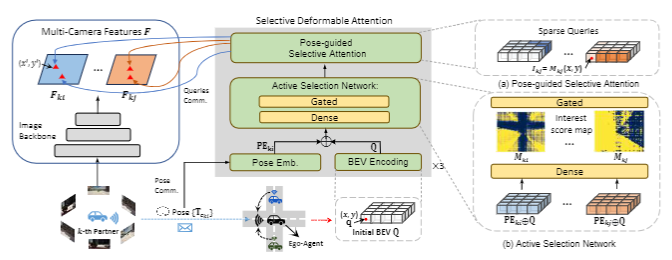

   
  
# ActFormer: Scalable Collaborative Perception via Active Queries

https://user-images.githubusercontent.com/27915819/161392594-fc0082f7-5c37-4919-830a-2dd423c1d025.mp4

# Abstract
Collaborative perception leverages rich visual observations from multiple robots to extend a single robot's perception ability beyond its field of view. 
Many prior works receive messages broadcast from all collaborators, leading to a scalability challenge when dealing with a large number of robots and sensors.
% Prior works struggle to scale when dealing with a high density of sensors or robots because of the dense utilization of all sensor measurements. 
In this work, we aim to address \textit{scalable camera-based collaborative perception} with a Transformer-based architecture. Our key idea is to enable a single robot to intelligently discern the relevance of the collaborators and their associated cameras according to a learned spatial prior. This proactive understanding of the visual features' relevance does not require the transmission of the features themselves, enhancing both communication and computation efficiency. Specifically, we present ActFormer, a Transformer that learns bird's eye view (BEV) representations by using predefined BEV queries to interact with multi-robot multi-camera inputs. Each BEV query can actively select relevant cameras for information aggregation based on pose information, instead of interacting with all cameras indiscriminately. Experiments on the V2X-Sim dataset demonstrate that ActFormer improves the detection performance from 29.89\% to 45.15\% in terms of AP@0.7 with about 50\% fewer queries, showcasing the effectiveness of ActFormer in multi-agent collaborative 3D object detection.

# Methods

