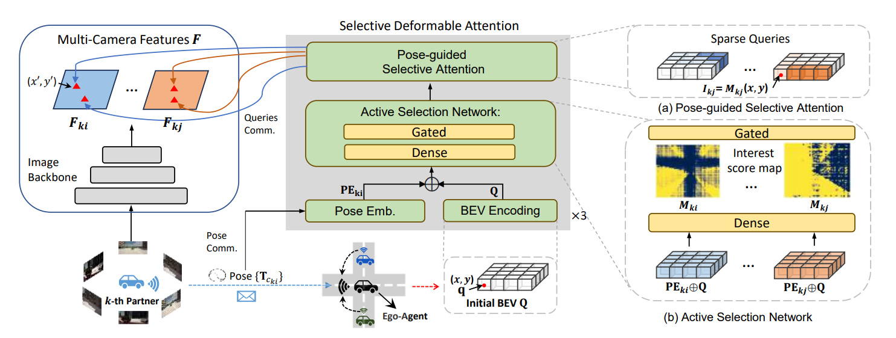

  
# ActFormer: Scalable Collaborative Perception via Active Queries

Official code for the paper [ActFormer: Scalable Collaborative Perception via Active Queries](
https://doi.org/10.48550/arXiv.2403.04968), and [project website](https://coperception.github.io/ActFormer/) accepted by *2024 IEEE International Conference on Robotics and Automation*. **Currently the code is a raw version, will be updated ASAP**. If you have any inquiries, feel free to contact <suozhi.huang@gmail.com>

# Abstract

Collaborative perception leverages rich visual observations from multiple robots to extend a single robot's perception ability beyond its field of view.
Many prior works receive messages broadcast from all collaborators, leading to a scalability challenge when dealing with a large number of robots and sensors.

In this work, we aim to address scalable camera-based collaborative perception with a Transformer-based architecture. Our key idea is to enable a single robot to intelligently discern the relevance of the collaborators and their associated cameras according to a learned spatial prior. This proactive understanding of the visual features' relevance does not require the transmission of the features themselves, enhancing both communication and computation efficiency. Specifically, we present ActFormer, a Transformer that learns bird's eye view (BEV) representations by using predefined BEV queries to interact with multi-robot multi-camera inputs. Each BEV query can actively select relevant cameras for information aggregation based on pose information, instead of interacting with all cameras indiscriminately. Experiments on the V2X-Sim dataset demonstrate that ActFormer improves the detection performance from 29.89\% to 45.15\% in terms of AP@0.7 with about 50\% fewer queries, showcasing the effectiveness of ActFormer in multi-agent collaborative 3D object detection.

# Methods

# Requirements

same as [BEVFormer](https://github.com/zhiqi-li/BEVFormer)

See details in [Install requirements](docs/install.md)

## Data

The experiments are completed in *nuscene* file format.

Download [V2X-Sim 2.0](https://ai4ce.github.io/V2X-Sim/)

See details in [Data Access](docs/prepare_dataset.md)

## Train & Test

see [train.py](tools/dist_train.sh) and [test.py](tools/dist_test.sh)

See train, test and visual details in [Start](docs/getting_started.md)
